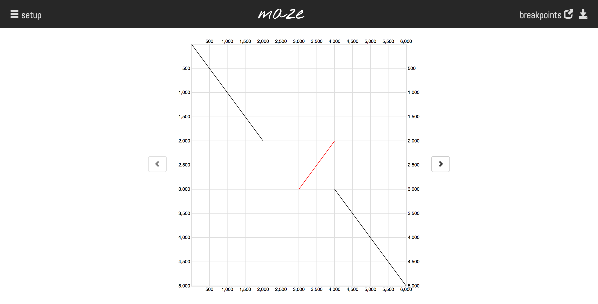

# maze: match visualizer



In a similar manner to
[dot plots](http://en.wikipedia.org/wiki/Dot_plot_%28bioinformatics%29),
`maze` highlights local sequence similarity between two DNA sequences. In
particular, maximal exact substring matches are computed with
[MUMmer3](http://mummer.sourceforge.net/) and visualised.

In the context of Delly this is most useful for exploring breakpoints or entire
SVs constructed with the local assembly pipeline, but `maze` has also been
instrumental in analysing SVs from "long read" data (PacBio, MinION) or Sanger
reads.

Our breakpoint module, which is still in an experimental state, highlights the
breakpoints of your assemblies relative to another sequence (e.g. the reference)
using local alignments computed with [last-split](http://last.cbrc.jp/).


## Requirements 

This software supports only Mac/Linux. Windows users could try our Docker image
[below](#docker) but this has not been tested.

For the server component, you will need Python2.7+ and the `Flask` and `click`
modules. An easy way to set this up is with a
[Virtual Environment](http://docs.python-guide.org/en/latest/dev/virtualenvs/):

    $ cd maze
    $ virtualenv venv
    $ source venv/bin/activate
    $ pip install -r requirements/python2.7.txt

In addition you need to have certain binaries in your `$PATH`:

   * `mummer` from [MUMmer3](http://mummer.sourceforge.net/) to compute matches
   * `lastdb` and `last-split` from [LAST](http://last.cbrc.jp/) version >= 584.

The LAST package is only needed when you plan to use the breakpoint module.

At last you will need a "modern" web browser. Chrome, Firefox and Safari should
all work. Technically, Opera and IE9+ should be fine as well although these
haven't been tested.


## Running the app

First off, start the server:

    $ python maze_server.py

By default, port 5000 is used, but you can specify this with the
`--port` option. Now, open your web browser and head to http://localhost:5000/.


## Input

Two *fasta/fastq* files.

   * **n vs. 1**: multiple sequences in the query are plotted against a single
     reference sequence. Useful for reads/assemblies of a single locus. Only the
     first entry in the reference file is used.
   * **n vs. n**: if both fasta files contain the same number of sequences, a
     pairwise comparison is triggered. Useful to scan multiple loci after
     another.

Click on the setup icon and upload the reference and query fasta files via
drag-and-drop. You can change the match type and length of MUMmer3. Hit
'visualize' to trigger match computation and visualization.


## Usability

Use left and right keys to browse through the plots. A click on the
'breakpoints' button takes you to a separate page showing details on the
breakpoints.

As this software is under development we are happy about feedback via mail or
via Github.


<a name="docker"/>
## Dockerized *maze*
</a>

*maze* is hosted on [Dockerhub](https://hub.docker.com/). To run it in Docker,
type

```
docker run -p 5000:5000 smei/maze
```

This will download the Docker image, if not yet available locally, run *maze* in
a Docker container and expose port 5000. Direct your browser to
`127.0.0.1:5000`.
